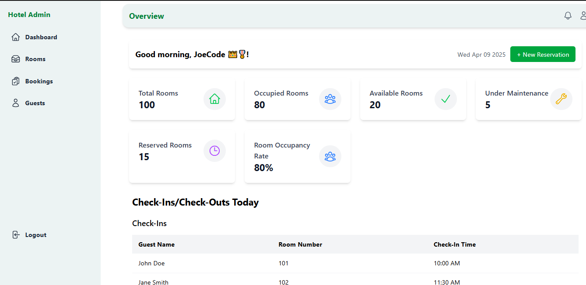
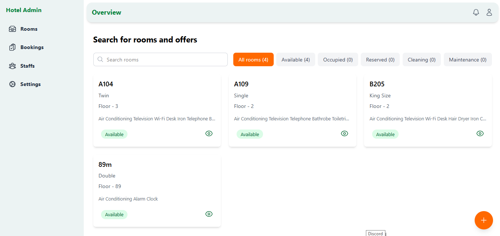
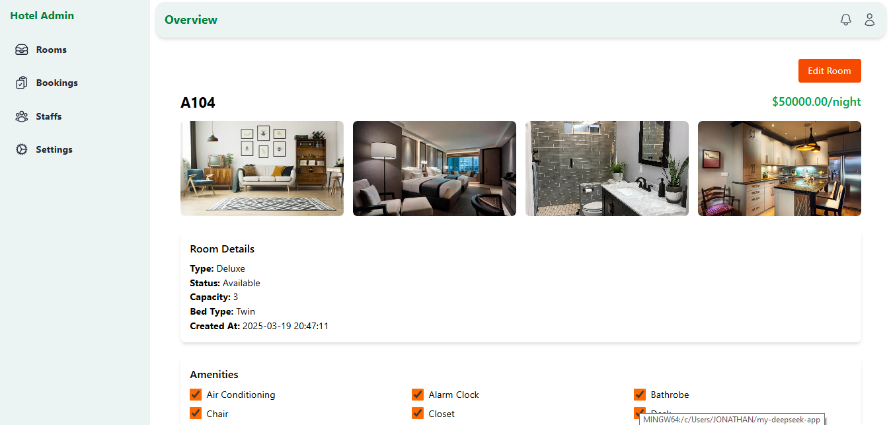
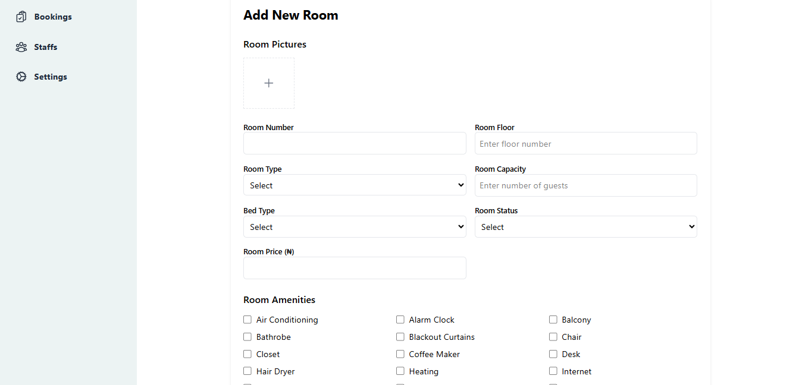
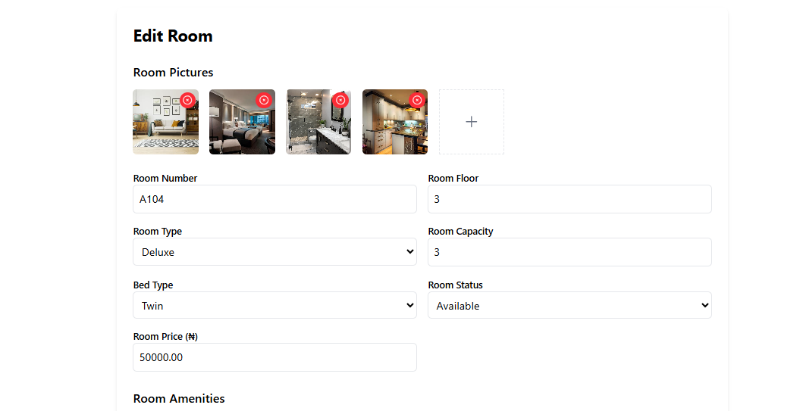
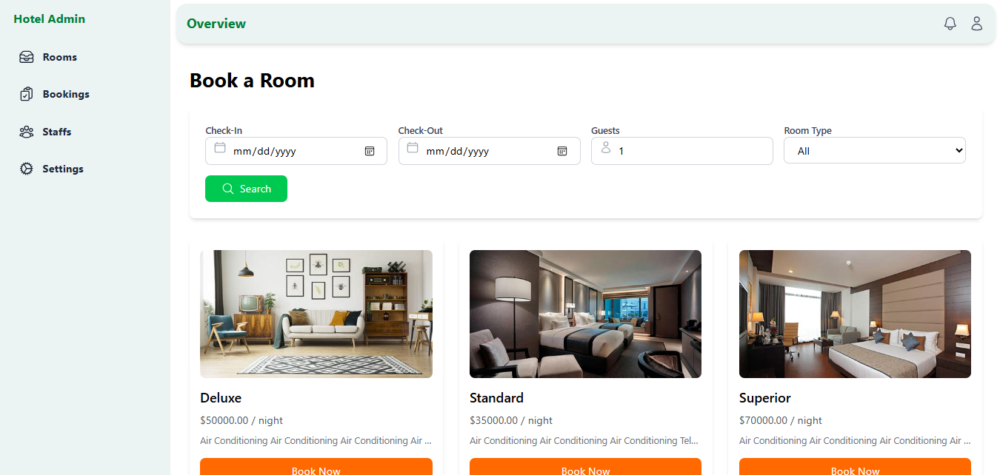
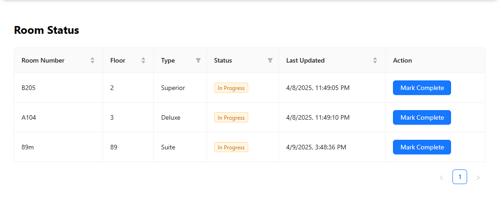
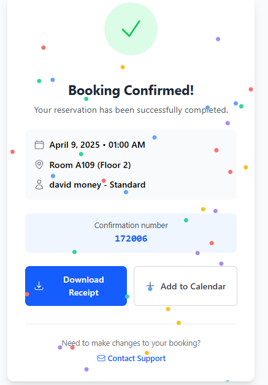

# 🏨 Hotel Management System



A **full-stack web application** for managing hotel operations, bookings, staff, and guest services with role-based access control.

---

## 🌟 Key Features
### 🔐 Authentication & Roles

- Secure JWT authentication for:
  - 🧑‍💼 **Admin** (Full access)
  - 🧹 **Housekeeping** (Room status updates)
  - 🏨 **Reception** (Bookings/check-ins)
  - 👨‍👩‍👦 **Guests** (Booking portal)

### 🛏️ Room Management




- Add/edit rooms with:t
  - 📸 Multiple images
  - 🛁 Amenities (WiFi, AC, Mini-bar)
  - 📊 Real-time availability calendar

### 📅 Booking System

- Online reservations with:
  - 🗓️ Date selection
  - 👥 Guest count
  - 💳 Secure payment gateway

### 🧹 Housekeeping

- Room status tracking:
  - 🟢 Clean
  - 🟠 Occupied
  - 🔴 Maintenance

### 💰 Payments & Invoices

- Multiple payment methods:
  - 💵 Cash
  - 💳 Cards (Paystack integration)
  - 📲 Mobile payments

---

## 🛠 Tech Stack
| Layer        | Technologies                                                                 |
|--------------|-----------------------------------------------------------------------------|
| **Frontend** | React 18 • TailwindCSS • Redux • React Router • Vite                        |
| **Backend**  | PHP 8.2 • MySQL • JWT Authentication                                       |
| **DevOps**   | Docker • GitHub Actions                                                    |

---

## 🚀 Installation
```bash
# Clone repository
git clone https://github.com/your-repo/hotel-management-system.git
cd hotel-management-system

# Install dependencies
npm install

# Start development server
npm run dev